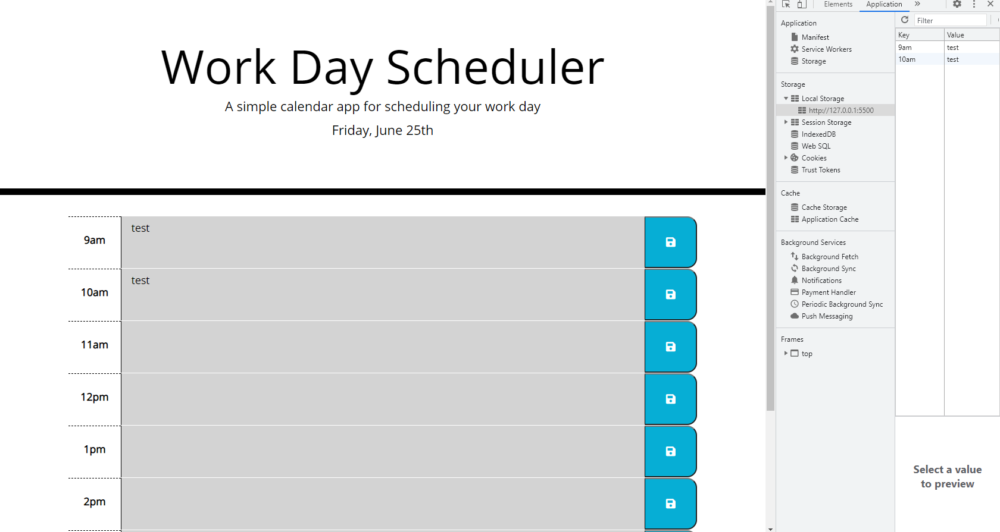

# Work Day Scheduler
This application is a daily scheduler that allows the user to input their plans for a corresponding hourly time slot on a particular day. The hourly time slots are color coded to let the user know whether or not that specific time slot for that day has already passed or not. Grey means the time slot has passed. Red means that this is the current time slot according to the current time of the day. Green means the time slot is coming up later in the day.

Upon visiting the webpage, at the top, the user is presented with the page's header title, a brief description of what the application does, and the current day of the week as well as the current month and day. Below that, the user will see columns of time slots for that day. Each time slot is made up of 3 sections, in a row format. The first section is the time of day, the second is the text area for the user to input any plans for their schedule at that time of day, and a save button to save their plans. The times of day encompass normal working hours starting from 9am up until 5pm. The text area is color coded so that the user will know whether the time slot has already passed, is the current time of day, or is later on in the day. Lastly, the save button on the right side of the page lets the user know that they can save their plans to the scheduler once they are finished. The button has a save icon as well that enlarges when hovered over it with the mouse. When the user saves something to the scheduler, they are able to leave the webpage and come back to it later with their saved plans still appearing on the webpage due to their inputs being saved to local storage.

## Link to Repository
[GitHub](https://github.com/mcall0147/work-day-scheduler)

## Link to Website
[Work Day Scheduler](https://mcall0147.github.io/work-day-scheduler/)

## Screenshot of Working Application
